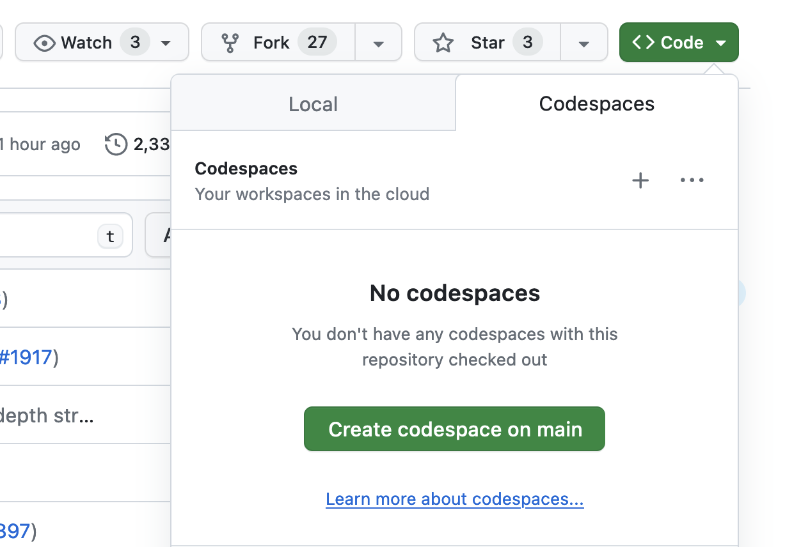
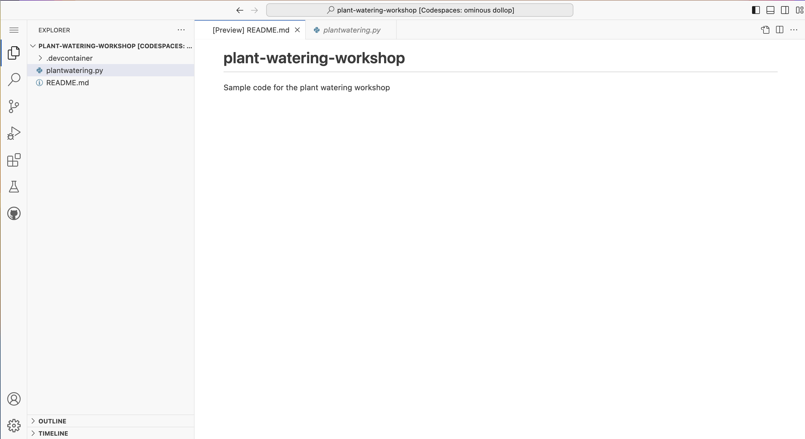
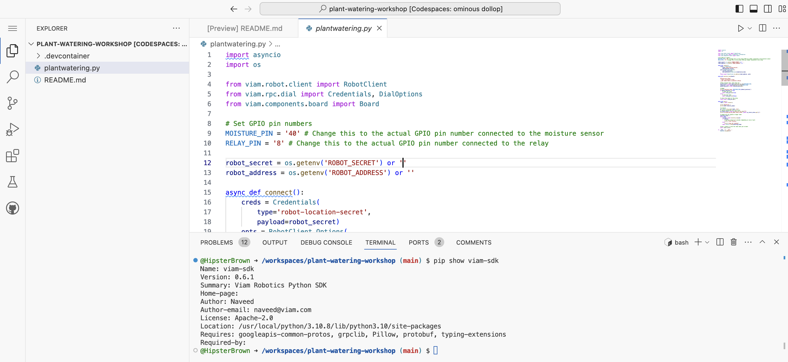

# Plant Watering Workshop

This project contains the sample code for the plant watering workshop and configuration for running it in a [Codespace](https://docs.github.com/en/codespaces/overview).

## Getting started

Github Codespaces provide a pre-configured development environment in the browser hosted in the cloud. This makes the setup process more consistent and quicker than your local development environment, as long as you have an Internet connection.

**You must be signed into a GitHub account to use Codespaces.**

After clicking on the green "<> Code" button and clicking the green "Create codespace on main" button within the prompt that appears (seen above), GitHub will prepare the environment before showing the Visual Studio Code editor in your browser:

This Codespace has been configured to automatically install the [`viam-sdk` Python package](https://python.viam.dev/).

